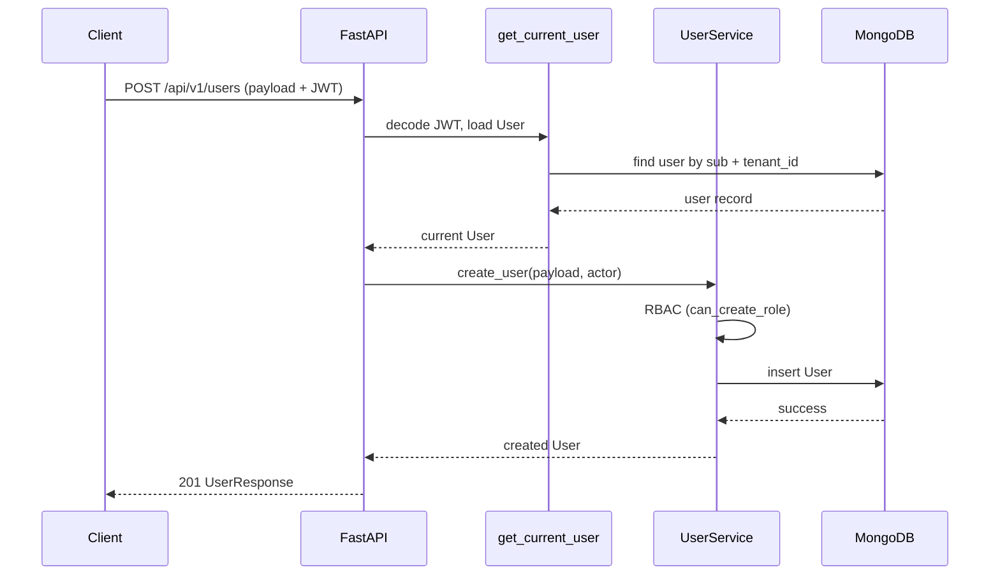

# Salon ERP — RBAC & User Management

## Roles (fixed set of four)

| Role | Description |
|------|-------------|
| `super_admin` | Platform operator; can create `salon_admin` and manage all tenants |
| `salon_admin` | Tenant owner; manages `salon_manager` and `employee` within tenant |
| `salon_manager` | Branch manager; can create/update `employee` only |
| `employee` | Staff; no user-management capabilities |

## Role capabilities

| Action | super_admin | salon_admin | salon_manager | employee |
|--------|:-----------:|:-----------:|:-------------:|:--------:|
| Create salon_admin | ✔️ (only) | ❌ | ❌ | ❌ |
| Create salon_manager | ✔️ | ✔️ | ❌ | ❌ |
| Create employee | ✔️ | ✔️ | ✔️ | ❌ |
| Update users (in tenant) | ✔️ | ✔️ (lower roles) | ✔️ (employee) | ❌ |
| Delete users (in tenant) | ✔️ | ✔️ | ❌ | ❌ |
| Assign roles / permissions | ✔️ | ✔️ | ❌ | ❌ |
| List users in tenant | ✔️ | ✔️ | ✔️ | ❌ |

## User creation sequence

## API endpoints

| Method | Path | Auth |
|--------|------|------|
| POST | `/api/v1/auth/bootstrap` | Public — creates tenant + first `salon_admin` |
| POST | `/api/v1/auth/login` | Public |
| POST | `/api/v1/users/` | Bearer JWT + RBAC |
| GET | `/api/v1/users/` | Bearer JWT + RBAC |
| GET | `/api/v1/users/{id}` | Bearer JWT + RBAC |
| PATCH | `/api/v1/users/{id}` | Bearer JWT + RBAC |
| DELETE | `/api/v1/users/{id}` | Bearer JWT + RBAC |

## Multi-tenant isolation

- All tenant-scoped documents extend `BaseTenantDocument` with `tenant_id`, soft-delete (`is_deleted`, `deleted_at`), and audit fields.
- `BaseRepository` injects `tenant_id` and `is_deleted=False` on queries via `tenant_context`.
- Compound indexes enforce uniqueness per tenant, e.g. `(tenant_id, email)` on `users`.
